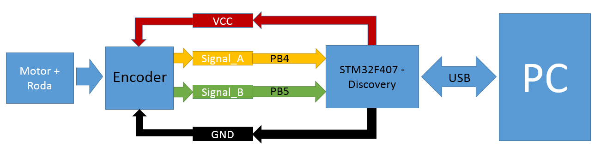

# Plot de velocidade de Motor DC em tempo real
## Proposta
Este projeto tem como objetivo plotar, em tempo real, a velocidade de um motor DC através da leitura de um encoder. Os sinais do encoder
serão enviados para duas portas GPIO da Discovery configuradas em modo Alternate Function que serão utilizadas para configurar um TIMER em
modo de leitura de encoder através de biblioteca da própria SPL (Standard Peripherals Library). Serão feitas medições periódicas no valor
do contador do TIMER a fim de, através das devidas conversões matemáticas, obter a velocidade do motor em tempo real.

Além disso, deve haver uma comunicação USB entre a Discovery e um PC de forma que os resultados de medição de velocidade sejam enviados 
continuamente para o PC, onde podem ser plotados através do LabView.

## Periféricos
No projeto serão utilizados:
1 STM32F407 Discovery
1 Motor DC 7.2V
1 Encoder em quadratura de 400 divisões
1 PC - LabView -
1 Roda de Metal

Figura 1: Diagrama de Blocos

## Pinagem
Motor0_ENCA -> PB4 -> TIM3_CH1: Encoder Mode
Motor0_ENCB -> PB5 -> TIM3_CH2: Encoder Mode
1ms Interrupter -> TIM6: Interrupt Enable
USB Serial -> PA11 e PB12: Special Mode

## Fluxograma
O código segue em um Loop Infinito até que seja chamada a interrupção do Timer 6, que acontece a cada 1ms, chamando a função controle que atualiza os vetores encoderCount e speed 
